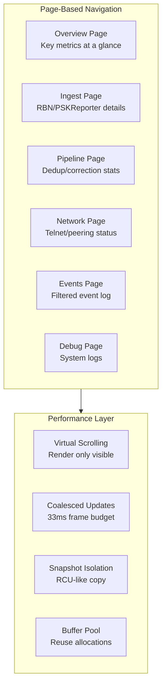

# tview UI Redesign Proposal

## Executive Summary

This proposal outlines a comprehensive redesign of the gocluster console UI. This version incorporates all corrections from review rounds, including explicit navigation contracts, complete lifecycle management, concrete snapshot API, and clarified resource ownership.

---

## 1. Current State Analysis

### 1.1 UI Architecture Overview

The current implementation supports three modes:
- **headless**: No UI, logs only
- **tview**: Interactive terminal UI using rivo/tview library
- **ansi**: Fixed-layout ANSI renderer with row-diff optimization

### 1.2 Current tview Implementation (`dashboard.go`)

**Structure:**
- Single-page vertical layout with 6 stacked panes
- Stats pane (8 lines) at top
- 5 event panes below (Dropped, Corrected, Unlicensed, Harmonics, System Log)
- Each pane is a `tview.TextView` with independent scrollback (2000 lines max)

**Performance Characteristics:**
```go
const (
    statsMaxLines   = 200    // Stats pane line limit
    paneMaxLines    = 2000   // Per-pane line limit (5 panes = 10K lines total)
    batchFlushEvery = 100 * time.Millisecond
    batchMaxLines   = 32
)
```

**Memory Footprint:**
- 5 panes × 2000 lines × ~100 bytes average = ~1MB+ for text storage
- tview internal buffer overhead (TextView maintains []byte buffer)
- Each `QueueUpdateDraw` triggers full layout recalculation
- No virtual scrolling - all content held in memory

**CPU Characteristics:**
- `QueueUpdateDraw` called on every batch flush (100ms) or when 32+ lines pending
- Each draw triggers tcell screen redraw
- TextView.SetText/Write reprocesses all color codes
- No dirty-region tracking - full pane redraws

### 1.3 Current ANSI Implementation (`ansi_console.go`)

**Structure:**
- Fixed 90×68 terminal layout
- 12 stats lines + 5 panes × (1 header + 10 lines)
- Row-diff rendering (only changed rows rewritten)

**Performance Characteristics:**
- Bounded memory: 68 rows × 90 cols = ~6KB frame buffer
- Coalesced renders with configurable refresh interval (default 16ms min)
- Single-writer to stdout
- Diff-based updates reduce terminal bandwidth

### 1.4 Data Sources and Metrics Visualized

#### Stats Pane (8 lines, updated every 5 seconds)
| Line | Content | Source |
|------|---------|--------|
| 1 | Uptime + Memory metrics | `tracker.GetUptime()`, `runtime.ReadMemStats()` |
| 2 | Grid database status | `gridMetrics`, `gridstore.Store.Count()` |
| 3 | CTY + FCC ULS data status | `ctyRefreshState`, `fccSnapshot` |
| 4 | RBN ingest stats (CW/RTTY/FT8/FT4) | `rbn.Client` counters |
| 5 | PSKReporter stats (CW/RTTY/FT8/FT4/MSK144) | `pskrClient` counters |
| 6 | Path-only processing stats | `pskPathOnly` metrics |
| 7 | Call corrections/unlicensed/harmonics/reputation counts | `stats.Tracker` |
| 8 | Pipeline throughput + Telnet client/drop stats | `dedup.GetStats()`, `telnetSrv` |

#### Event Panes (append-only scrollback)
| Pane | Data Source | Trigger Frequency |
|------|-------------|-------------------|
| Dropped | CTY validation, PC61 parse, reputation drops | Medium |
| Corrected | Call correction algorithm | Low-Medium |
| Unlicensed | FCC ULS license validation | Low |
| Harmonics | Harmonic suppression detection | Low |
| System Log | Application logging | High |

---

## 2. Performance Issues Identified

### 2.1 tview-Specific Issues

1. **Unbounded TextView Buffers**
   - Each pane holds 2000 lines in memory indefinitely
   - TextView stores raw []byte with color codes
   - No compression or deduplication

2. **Excessive QueueUpdateDraw Calls**
   - Current batching: 100ms or 32 lines
   - Under high load (100+ spots/sec), batches flush frequently
   - Each flush triggers 5-6 separate `QueueUpdateDraw` calls

3. **No Virtual Scrolling**
   - tview.TextView renders all visible + buffered content
   - ScrollToEnd() requires reprocessing entire buffer

4. **Layout Recalculation on Every Draw**
   - Flex layout recalculates all pane sizes
   - No incremental layout updates

5. **Color Code Processing**
   - Dynamic color tags parsed on every draw
   - No precomputed color regions

### 2.2 Architectural Issues

1. **Mixed Concerns**
   - Stats (periodic, high-level) mixed with Events (append-only, detailed)
   - System log (high volume) competes with rare events (harmonics)

2. **No Prioritization**
   - System log can drown out important drop events
   - No visual hierarchy

3. **Limited Discoverability**
   - All data visible at once but cramped
   - No drill-down capability

---

## 3. Proposed Redesign

### 3.1 High-Level Architecture



### 3.2 Page Design

#### Page 1: Overview (Default) - F2
**Purpose:** Critical metrics at a glance for operators

**Layout:**
```
┌─────────────────────────────────────────────────────────────┐
│  DX Cluster Server v1.0.0        Uptime: 48:32   Nodes: 3   │
├─────────────────────────────────────────────────────────────┤
│  MEMORY                                                     │
│  Exec: 45MB  Ring: 12MB  Dedup: 8MB (23%)  Meta: 4MB (89%) │
├─────────────────────────────────────────────────────────────┤
│  INGEST RATES                    PIPELINE                   │
│  RBN: 1,234/min                  Primary: 98.5%             │
│  PSK: 5,678/min                  Secondary: F:95% M:92% S:88│
├─────────────────────────────────────────────────────────────┤
│  TELNET                          GRID DB                    │
│  Clients: 42/100                 Records: 1.2M  Hit: 94%    │
│  Drops: Q:0 C:0 W:0              Rate: 45K/min              │
├─────────────────────────────────────────────────────────────┤
│  [F1:Help] [F2:Overview] [F3:Ingest] [F4:Pipeline] ...      │
└─────────────────────────────────────────────────────────────┘
```

**Metrics Shown:**
- Server version and uptime
- Memory breakdown (exec, ring, dedup, meta cache)
- Ingest rates by source
- Pipeline efficiency percentages
- Telnet client count and drop reasons
- Grid DB record count and cache hit rate

**Update Frequency:** 5 seconds (configurable)

---

#### Page 2: Ingest Details - F3
**Purpose:** Deep dive into RBN and PSKReporter ingestion

**Layout:**
```
┌─────────────────────────────────────────────────────────────┐
│  INGEST SOURCES                          [F3] Page 2/6      │
├──────────────────────┬──────────────────────────────────────┤
│  RBN (telnet)        │  PSKReporter (MQTT)                  │
│  ─────────────────   │  ─────────────────                   │
│  Host: telnet.reverse│  Broker: pskreporter.info            │
│  Status: Connected   │  Status: Connected                   │
│  Uptime: 2h15m       │  Uptime: 48h32m                      │
│                      │                                      │
│  SPOTS/MINUTE        │  SPOTS/MINUTE                        │
│  CW:    234          │  CW:      123                        │
│  RTTY:  456          │  RTTY:    789                        │
│  FT8:   890          │  FT8:    2345                        │
│  FT4:   123          │  FT4:     567                        │
│  ─────────────────   │  MSK144:   89                        │
│  Total: 1,703        │  Total:   3,913                      │
│                      │                                      │
│  CONNECTION STATS    │  CONNECTION STATS                    │
│  Reconnects: 0       │  Reconnects: 1                       │
│  Parse errors: 12    │  Drops (queue): 0                    │
│  Keepalive: OK       │  Drops (stale): 45                   │
└──────────────────────┴──────────────────────────────────────┘
```

**Metrics Shown:**
- Connection status and uptime per source
- Spot rates broken down by mode
- Connection health (reconnects, errors, drops)
- Path-only metrics (if enabled)

---

#### Page 3: Pipeline - F4
**Purpose:** Deduplication and call correction performance

**Layout:**
```
┌─────────────────────────────────────────────────────────────┐
│  PIPELINE PROCESSING                     [F4] Page 3/6      │
├─────────────────────────────────────────────────────────────┤
│  PRIMARY DEDUPLICATION                                      │
│  ┌─────────────────────────────────────────────────────┐   │
│  │ Processed: 1,234,567  │  Duplicates: 456,789 (37%)  │   │
│  │ Cache size: 12,345    │  Entry size: 32 bytes       │   │
│  └─────────────────────────────────────────────────────┘   │
├─────────────────────────────────────────────────────────────┤
│  SECONDARY DEDUPLICATION (SNR-based)                        │
│  ┌─────────────┬─────────────┬─────────────┐                 │
│  │ Fast (5s)   │ Med (30s)   │ Slow (60s)  │                 │
│  │ ─────────── │ ─────────── │ ─────────── │                 │
│  │ Proc: 100K  │ Proc: 200K  │ Proc: 150K  │                 │
│  │ Dup:  30K   │ Dup:  80K   │ Dup:  45K   │                 │
│  │ Fwd:  70K   │ Fwd:  120K  │ Fwd:  105K  │                 │
│  │ Cache: 2MB  │ Cache: 4MB  │ Cache: 3MB  │                 │
│  └─────────────┴─────────────┴─────────────┘                 │
├─────────────────────────────────────────────────────────────┤
│  CALL CORRECTION                                            │
│  Corrections: 1,234  Rejected: 56  Suppressed: 12           │
│  Avg confidence: 78%  Avg supporters: 4.2                   │
├─────────────────────────────────────────────────────────────┤
│  HARMONIC SUPPRESSION                                       │
│  Suppressed: 890  Patterns detected: 23                     │
└─────────────────────────────────────────────────────────────┘
```

---

#### Page 4: Network - F5
**Purpose:** Telnet server and peering status

**Layout:**
```
┌─────────────────────────────────────────────────────────────┐
│  NETWORK STATUS                          [F5] Page 4/6      │
├──────────────────────┬──────────────────────────────────────┤
│  TELNET SERVER       │  PEERING                             │
│  ─────────────────   │  ─────────────────                   │
│  Port: 7300          │  Local: N2WQ-22                      │
│  TLS: Enabled        │  Status: 3 active / 5 configured     │
│                      │                                      │
│  CLIENTS (42/100)    │  ACTIVE PEERS                        │
│  ┌───────────────┐   │  ┌─────────┬────────┬────────────┐   │
│  │ Auth: 38      │   │  │ Node    │ Uptime │ Last PC92  │   │
│  │ Anon: 4       │   │  ├─────────┼────────┼────────────┤   │
│  │ Reputation: 0 │   │  │ N1ABC-1 │ 2h15m  │ 45s ago    │   │
│  └───────────────┘   │  │ W2XYZ-3 │ 48h32m │ 12s ago    │   │
│                      │  │ K3DEF-2 │ 15m    │ 3s ago     │   │
│  BROADCAST STATS     │  └─────────┴────────┴────────────┘   │
│  Queue drops: 0      │                                      │
│  Client drops: 12    │  TOPOLOGY                            │
│  Send failures: 3    │  Nodes known: 45                     │
│                      │  Users known: 1,234                  │
└──────────────────────┴──────────────────────────────────────┘
```

---

#### Page 5: Events - F6
**Purpose:** Filterable event log with severity levels

**Layout:**
```
┌─────────────────────────────────────────────────────────────┐
│  EVENT LOG                               [F6] Page 5/6      │
├─────────────────────────────────────────────────────────────┤
│  [All] [Drops] [Corrections] [Unlicensed] [Harmonics] [Sys] │
├─────────────────────────────────────────────────────────────┤
│  15:04:32  [DROP] CTY validation failed: XX1ABC from RBN    │
│  15:04:28  [CORRECT] K1ABC -> KL1ABC at 14100.0 kHz (3/75%) │
│  15:04:15  [UNLIC] US Tech KF5XYZ dropped from PSK FT8      │
│  15:03:59  [DROP] Reputation: IP 192.168.1.1 throttled      │
│  15:03:45  [HARM] Suppressed harmonic at 28200.0 kHz        │
│  15:03:12  [DROP] PC61 parse error: malformed spot          │
│           ... (virtual scroll: 1,234 events in buffer)      │
├─────────────────────────────────────────────────────────────┤
│  Showing: Drops, Corrections, Unlicensed  Total: 1,234      │
└─────────────────────────────────────────────────────────────┘
```

**Features:**
- Tab-based filtering (All, Drops, Corrections, Unlicensed, Harmonics, System)
- Virtual scrolling (only visible rows rendered)
- Color-coded severity
- Configurable buffer size (default: 1000 events)

---

#### Page 6: Debug - F7
**Purpose:** System logs and diagnostic information

**Layout:**
```
┌─────────────────────────────────────────────────────────────┐
│  SYSTEM LOG                              [F7] Page 6/6      │
├─────────────────────────────────────────────────────────────┤
│  [INFO] [WARN] [ERROR] [DEBUG]  Level: [INFO ▼] Search: []  │
├─────────────────────────────────────────────────────────────┤
│  15:04:32 INF gridstore checkpoint completed duration=45ms  │
│  15:04:15 WRN CTY refresh failed, retry in 5m err=timeout   │
│  15:03:59 INF telnet client connected addr=192.168.1.1:54321│
│  15:03:45 DBG harmonic detector: checking 14100.0 kHz       │
│  15:03:12 INF RBN reconnect successful host=telnet.reversebe│
│           ... (virtual scroll: 5,000 lines in buffer)       │
├─────────────────────────────────────────────────────────────┤
│  Buffer: 5,000/10,000 lines  Filter: "checkpoint"           │
└─────────────────────────────────────────────────────────────┘
```

---

### 3.3 Navigation Model (FINAL)

**Primary Navigation (F-keys):**
```
Key Bindings:
  F1          : Help overlay
  F2          : Overview page (default on startup)
  F3          : Ingest page
  F4          : Pipeline page
  F5          : Network page
  F6          : Events page
  F7          : Debug page
  Tab         : Next page
  Shift+Tab   : Previous page
  q or Ctrl+C : Quit
```

**Help Overlay:**
```
Key Bindings:
  ? or h      : Help overlay (alias)
```

**Alternative Navigation (for terminals without F-keys):**
```
  o           : Overview
  i           : Ingest
  p           : Pipeline
  n           : Network
  e           : Events
  d           : Debug
  h or ?      : Help overlay
```

**Within Events/Debug pages:**
```
  ↑/↓ or k/j  : Scroll
  PageUp/Down : Fast scroll
  Home/End    : Jump to start/end
  1-6         : Filter tabs (Events page)
  /           : Search (with 250ms debounce)
  Esc         : Clear search/exit overlay
```

**Navigation Contract:**
- F1 is **always** Help
- F2 is **always** Overview (default on startup)
- Footer on all pages shows: `[F1:Help] [F2:Overview] [F3:Ingest] ... [Q]Quit`

---

## 4. Performance Optimization Strategy

### 4.1 Concurrency and Ownership Model

**Design Principle:** Single-writer to event buffers, RCU-style snapshot for readers

```go
// EventBuffer provides thread-safe append with RCU snapshot
type EventBuffer struct {
    mu       sync.RWMutex
    events   []StyledEvent           // Protected by mu
    head     int                     // Write position
    count    int                     // Current count
    maxCount int                     // Hard limit
    maxBytes int64                   // Soft byte limit
    curBytes int64                   // Current byte usage
    generation uint64                // Incremented on each append
}

// Append is called by ingest goroutines (single writer assumed per buffer)
// If multiple writers, wrap with mutex
func (b *EventBuffer) Append(e StyledEvent) bool {
    msgSize := int64(len(e.Message))
    if msgSize > maxMessageSize {
        metrics.uiDroppedEventsTotal.WithLabelValues("oversized").Inc()
        return false  // Drop oversized
    }
    
    b.mu.Lock()
    defer b.mu.Unlock()
    
    // Evict oldest until we have room (count AND bytes)
    for b.count >= b.maxCount || (b.curBytes+msgSize > b.maxBytes && b.count > 0) {
        old := b.events[b.head]
        b.curBytes -= int64(len(old.Message))
        b.head = (b.head + 1) % len(b.events)
        b.count--
        metrics.uiDroppedEventsTotal.WithLabelValues("evicted").Inc()
    }
    
    if msgSize > b.maxBytes {
        metrics.uiDroppedEventsTotal.WithLabelValues("max_bytes").Inc()
        return false
    }
    
    pos := (b.head + b.count) % len(b.events)
    b.events[pos] = e
    b.curBytes += msgSize
    b.count++
    b.generation++
    return true
}

// Snapshot returns an immutable copy for the render thread
// Ownership: Caller receives heap-allocated slice; caller frees (GC)
// Lifetime: Valid for duration of single render frame
func (b *EventBuffer) Snapshot() Snapshot {
    b.mu.RLock()
    defer b.mu.RUnlock()
    
    result := make([]StyledEvent, b.count)
    for i := 0; i < b.count; i++ {
        pos := (b.head + i) % len(b.events)
        result[i] = b.events[pos]
    }
    return Snapshot{
        Events:     result,
        Generation: b.generation,
        Timestamp:  time.Now(),
    }
}

// Snapshot is an immutable point-in-time view
type Snapshot struct {
    Events     []StyledEvent  // Immutable copy
    Generation uint64         // For cache invalidation
    Timestamp  time.Time      // For age tracking
}
```

**Concurrency Contract:**
- **Writer (ingest goroutine):** Holds `b.mu` during append; increments generation
- **Reader (render goroutine):** Takes snapshot under `RLock`; releases before render
- **Snapshot ownership:** Render thread owns the returned slice; GC collects after render
- **No lock during render:** VirtualList operates on immutable Snapshot only

### 4.2 VirtualList with Snapshot Isolation

```go
// VirtualList renders only visible rows from a snapshot
type VirtualList struct {
    *tview.Box
    snapshot     Snapshot         // Immutable snapshot (set per frame)
    visibleRows  int              // Calculated from viewport
    scrollOffset int              // User scroll position
    
    // Render cache (per-frame, no locking needed)
    rowCache     map[int]string   // Line index -> formatted string
    cacheGen     uint64           // Snapshot generation for cache validity
}

// SetSnapshot updates the immutable data source
// Call this at frame start, before Draw
func (v *VirtualList) SetSnapshot(s Snapshot) {
    v.snapshot = s
    if v.cacheGen != s.Generation {
        v.rowCache = make(map[int]string, v.visibleRows)
        v.cacheGen = s.Generation
    }
    
    // Clamp scroll offset to valid range
    maxOffset := max(0, len(s.Events)-v.visibleRows)
    if v.scrollOffset > maxOffset {
        v.scrollOffset = maxOffset
    }
}

func (v *VirtualList) Draw(screen tcell.Screen) {
    x, y, width, height := v.GetRect()
    v.visibleRows = height
    
    for i := 0; i < v.visibleRows && v.scrollOffset+i < len(v.snapshot.Events); i++ {
        rowIdx := v.scrollOffset + i
        line := v.formatRow(rowIdx, width)
        drawString(screen, x, y+i, line, tcell.StyleDefault)
    }
}

func (v *VirtualList) formatRow(idx int, width int) string {
    if cached, ok := v.rowCache[idx]; ok {
        return cached
    }
    // Format from snapshot (immutable, no lock needed)
    event := v.snapshot.Events[idx]
    formatted := fmt.Sprintf("%s [%s] %s",
        event.Timestamp.Format("15:04:05"),
        event.Severity,
        truncate(event.Message, width-25))
    v.rowCache[idx] = formatted
    return formatted
}
```

**Snapshot API Contract:**
1. **Creation:** `EventBuffer.Snapshot()` creates heap-allocated copy under RLock
2. **Ownership:** Caller (VirtualList) owns the slice; no reference back to buffer
3. **Lifetime:** Valid for one render frame; discard after Draw completes
4. **Consistency:** Generation counter detects stale cache
5. **Performance:** Allocation per frame; GC pressure acceptable at 30fps

### 4.3 Frame Scheduler with Bounded Drain

```go
type frameScheduler struct {
    app       *tview.Application
    pending   map[string]func()
    mu        sync.Mutex
    ticker    *time.Ticker
    quit      chan struct{}
    wg        sync.WaitGroup
    
    frameTime    time.Duration  // Target frame time (33ms for 30fps)
    drainTimeout time.Duration  // Max time to drain on stop
}

func newFrameScheduler(app *tview.Application, targetFPS int) *frameScheduler {
    if targetFPS <= 0 {
        targetFPS = 30
    }
    return &frameScheduler{
        app:          app,
        pending:      make(map[string]func()),
        quit:         make(chan struct{}),
        frameTime:    time.Second / time.Duration(targetFPS),
        drainTimeout: 100 * time.Millisecond,
    }
}

func (f *frameScheduler) Start() {
    f.wg.Add(1)
    go f.run()
}

// Stop performs bounded drain of pending updates
func (f *frameScheduler) Stop() {
    close(f.quit)

    // Wait for run() to exit with timeout
    done := make(chan struct{})
    go func() {
        f.wg.Wait()
        close(done)
    }()

    select {
    case <-done:
        // Clean shutdown
    case <-time.After(f.drainTimeout):
        // Timeout: some updates may be lost
        log.Printf("UI: frame scheduler drain timeout after %v", f.drainTimeout)
    }
}

func (f *frameScheduler) Schedule(id string, fn func()) {
    f.mu.Lock()
    defer f.mu.Unlock()
    f.pending[id] = fn  // Coalesce by pane ID
}

func (f *frameScheduler) run() {
    defer f.wg.Done()

    ticker := time.NewTicker(f.frameTime)
    defer ticker.Stop()

    for {
        select {
        case <-ticker.C:
            f.flush()
        case <-f.quit:
            // Final flush before exit (bounded by drainTimeout)
            f.flushBounded(f.drainTimeout)
            return
        }
    }
}

func (f *frameScheduler) flush() {
    f.mu.Lock()
    if len(f.pending) == 0 {
        f.mu.Unlock()
        return
    }
    batch := f.pending
    f.pending = make(map[string]func())
    f.mu.Unlock()

    f.app.QueueUpdateDraw(func() {
        for _, fn := range batch {
            fn()
        }
    })
}

func (f *frameScheduler) flushBounded(max time.Duration) {
    deadline := time.Now().Add(max)
    for {
        if time.Now().After(deadline) {
            return
        }
        f.mu.Lock()
        if len(f.pending) == 0 {
            f.mu.Unlock()
            return
        }
        batch := f.pending
        f.pending = make(map[string]func())
        f.mu.Unlock()

        f.app.QueueUpdateDraw(func() {
            for _, fn := range batch {
                fn()
            }
        })
    }
}
```

**Shutdown Contract:**
1. `Stop()` closes quit channel
2. `run()` sees quit, drains pending updates within `drainTimeout`
3. `Stop()` waits for `wg.Wait()` with `drainTimeout`
4. If timeout: log warning, return (UI updates may be lost)
5. **No goroutine leak:** `wg.Done()` called in deferred `run()` exit

### 4.4 Search Debouncer with Lifecycle

```go
type SearchFilter struct {
    query      string
    mu         sync.RWMutex
    results    []int           // Indices into original buffer
    debouncer  *time.Timer
    ctx        context.Context // Page lifecycle context
}

func NewSearchFilter(ctx context.Context) *SearchFilter {
    return &SearchFilter{
        ctx: ctx,
    }
}

// Stop cancels pending search and waits for callback completion
func (s *SearchFilter) Stop() {
    s.mu.Lock()
    if s.debouncer != nil {
        s.debouncer.Stop()
    }
    s.mu.Unlock()
    // No pending callback after Stop returns
}

func (s *SearchFilter) SetQuery(query string, source Snapshot, callback func()) {
    s.mu.Lock()
    defer s.mu.Unlock()
    
    s.query = strings.ToLower(query)
    
    // Cancel pending search
    if s.debouncer != nil {
        s.debouncer.Stop()
    }
    
    // Check context before scheduling
    if s.ctx.Err() != nil {
        return
    }
    
    // Debounce search execution
    s.debouncer = time.AfterFunc(searchDebounce, func() {
        // Check context in callback
        if s.ctx.Err() != nil {
            return
        }
        s.executeSearch(source)
        
        // Check context before UI update
        if s.ctx.Err() != nil {
            return
        }
        callback()
    })
}

func (s *SearchFilter) executeSearch(source Snapshot) {
    s.mu.Lock()
    defer s.mu.Unlock()
    
    if s.query == "" {
        s.results = nil
        return
    }
    
    s.results = make([]int, 0, min(maxSearchResults, len(source.Events)))
    for i, event := range source.Events {
        if strings.Contains(strings.ToLower(event.Message), s.query) {
            s.results = append(s.results, i)
            if len(s.results) >= maxSearchResults {
                break
            }
        }
    }
}

func (s *SearchFilter) GetFilteredIndices() []int {
    s.mu.RLock()
    defer s.mu.RUnlock()
    return s.results
}
```

**Lifecycle Contract:**
1. Page creates `SearchFilter(ctx)` with page lifecycle context
2. `SetQuery()` checks `ctx.Err()` before and after scheduling
3. Callback checks `ctx.Err()` before UI update
4. Page `Stop()` calls `searchFilter.Stop()` then cancels context
5. **No callback after Stop:** Timer stopped, context cancelled

### 4.5 Memory-Bounded Event Buffers with Drop Policy

```go
const (
    defaultEventMaxCount = 1000
    defaultEventMaxBytes = 1 * 1024 * 1024  // 1MB
    defaultDebugMaxCount = 5000
    defaultDebugMaxBytes = 2 * 1024 * 1024  // 2MB
    maxMessageSize       = 4096             // Configurable, see below
)

// DropPolicy defines behavior when buffer limits exceeded
type DropPolicy struct {
    MaxMessageSize    int   // Reject messages larger than this (0 = unlimited)
    EvictOnByteLimit  bool  // If true, evict oldest; if false, reject new
    LogDrops          bool  // Log when events dropped
}

var defaultDropPolicy = DropPolicy{
    MaxMessageSize:   4096,
    EvictOnByteLimit: true,
    LogDrops:         true,
}

type BoundedEventBuffer struct {
    mu       sync.RWMutex
    events   []StyledEvent
    head     int
    count    int
    maxCount int
    maxBytes int64
    curBytes int64
    policy   DropPolicy
    name     string // For metrics
}

func (b *BoundedEventBuffer) Append(e StyledEvent) bool {
    msgSize := int64(len(e.Message))
    
    // Check max message size (configurable drop policy)
    if b.policy.MaxMessageSize > 0 && len(e.Message) > b.policy.MaxMessageSize {
        if b.policy.LogDrops {
            log.Printf("UI: dropped oversized event (%d bytes > %d limit)",
                len(e.Message), b.policy.MaxMessageSize)
        }
        metrics.uiDroppedEventsTotal.WithLabelValues("oversized", b.name).Inc()
        return false
    }
    
    b.mu.Lock()
    defer b.mu.Unlock()
    
    // If at count limit, always evict
    for b.count >= b.maxCount {
        b.evictOldest()
    }
    
    // If byte limit would be exceeded
    if b.curBytes+msgSize > b.maxBytes {
        if !b.policy.EvictOnByteLimit {
            metrics.uiDroppedEventsTotal.WithLabelValues("byte_limit", b.name).Inc()
            return false
        }
        // Evict oldest until we have room
        for b.count > 0 && b.curBytes+msgSize > b.maxBytes {
            b.evictOldest()
        }
    }
    
    pos := (b.head + b.count) % len(b.events)
    b.events[pos] = e
    b.curBytes += msgSize
    b.count++
    return true
}

func (b *BoundedEventBuffer) evictOldest() {
    old := b.events[b.head]
    b.curBytes -= int64(len(old.Message))
    b.head = (b.head + 1) % len(b.events)
    b.count--
    metrics.uiDroppedEventsTotal.WithLabelValues("evicted", b.name).Inc()
}
```

**Drop Policy Contract:**
1. **Oversized messages (>4096 bytes):** Dropped, counted in metrics
2. **Count limit:** Oldest evicted (circular buffer behavior)
3. **Byte limit:** Configurable - evict oldest OR reject new
4. **Observability:** All drops counted with reason label

**User-Visible Behavior:**
- Footer shows: `Buffer: 1,234/1,000 events (34 evicted)`
- Log line when oversized message dropped (if LogDrops enabled)
- Metrics: `ui_dropped_events_total{reason="oversized|evicted|byte_limit",page="events|debug"}`

---

## 5. Implementation Plan

### 5.1 Phase 1: Foundation (Non-breaking)

1. **Create new package `ui/`**
   - `ui/surface.go`: uiSurface interface (moved from main)
   - `ui/metrics.go`: Metric collection types
   - `ui/buffer.go`: Bounded circular buffer with byte limits and drop policy

2. **Implement VirtualList component**
   - `ui/virtual_list.go`
   - RCU snapshot isolation
   - Unit tests for scrolling correctness
   - Benchmark for render performance

3. **Implement frame scheduler**
   - `ui/scheduler.go`
   - Lifecycle management (Start/Stop with bounded drain)
   - Coalesced update batching

### 5.2 Phase 2: Page Implementation

1. **Overview page** (`ui/pages/overview.go`)
   - Grid layout with 6 metric panels
   - 5-second refresh timer

2. **Ingest page** (`ui/pages/ingest.go`)
   - Split-pane layout
   - Real-time rate updates

3. **Pipeline page** (`ui/pages/pipeline.go`)
   - Bar charts for dedup stats
   - Progress bars for efficiency

4. **Network page** (`ui/pages/network.go`)
   - Connection tables
   - Peer status indicators

5. **Events page** (`ui/pages/events.go`)
   - Virtual scrolling list with RCU snapshot
   - Tab filtering
   - Search with debounce and lifecycle

6. **Debug page** (`ui/pages/debug.go`)
   - Log level filtering
   - Search functionality

### 5.3 Phase 3: Integration

1. **New dashboard implementation**
   - `ui/dashboard_v2.go`
   - Page switcher
   - Keyboard navigation (F1-F7, ?, alternatives)

2. **Config updates**
   ```yaml
   ui:
     mode: tview-v2  # New option
     v2:
       pages:
         - overview
         - ingest
         - pipeline
         - network
         - events
         - debug
       event_buffer:
         max_events: 1000
         max_bytes_mb: 1
         max_message_bytes: 4096  # Drop messages larger than this
         evict_on_byte_limit: true
         log_drops: true
       debug_buffer:
         max_events: 5000
         max_bytes_mb: 2
         max_message_bytes: 4096
         evict_on_byte_limit: true
         log_drops: false
       target_fps: 30
       enable_mouse: false
       keybindings:
         use_alternatives: true  # Enable o/i/p/n/e/d navigation
   ```

3. **Migration path**
   - Keep `dashboard.go` as legacy
   - Add `ui.mode: tview-v2` option
   - Deprecation timeline for old mode

### 5.4 Phase 4: Optimization and Validation

1. **Profiling methodology (per OPTIMIZATION.md)**
   ```bash
   # Baseline measurement
   set DXC_PPROF_ADDR=localhost:6061
   set ui.mode=headless  # Measure without UI first
   
   # Capture profiles
   curl "http://localhost:6061/debug/pprof/profile?seconds=120" -o baseline.pprof
   
   # With new UI
   set ui.mode=tview-v2
   curl "http://localhost:6061/debug/pprof/profile?seconds=120" -o tviewv2.pprof
   
   # Compare
   go tool pprof -top baseline.pprof
   go tool pprof -top tviewv2.pprof
   ```

2. **Performance targets with measurement criteria**

   | Metric | Target | Measurement Method |
   |--------|--------|-------------------|
   | CPU overhead | <5% at 100 spots/sec | `go tool pprof` flat time for `ui.*` functions |
   | Memory overhead | <10MB | `runtime.ReadMemStats` delta (ui.mode=headless vs tview-v2) |
   | Render latency | p99 <33ms | Histogram in frameScheduler (time.QueueUpdateDraw to return) |
   | Search latency | p99 <50ms | Timer around executeSearch with 5000 event buffer |
   | Shutdown time | <100ms | Timer around Stop() call |

3. **Validation checklist**
   - [ ] CPU profiles show <5% in UI package at 100 spots/sec
   - [ ] Memory delta <10MB vs headless mode
   - [ ] p99 render latency <33ms (measured over 1 hour)
   - [ ] No goroutine leaks (goroutine profile stable after 24h)
   - [ ] Search with 5000 events completes in <50ms p99
   - [ ] Shutdown completes in <100ms
   - [ ] All drops observable in metrics with reason label

---

## 6. Resource Bounds and Safety

### 6.1 Goroutine Budget

| Component | Count | Purpose | Lifecycle |
|-----------|-------|---------|-----------|
| Frame scheduler | 1 | Update coalescing | Start() -> Stop() with timeout |
| Page refresh timers | 6 | Periodic metric updates | Per-page, ctx.Done() |
| Event append | 0 | Synchronous (caller) | N/A |
| Search debouncer | 0-1 | Per-page, on-demand | ctx.Done() + Stop() |
| **Total** | **7-8** | Fixed, not scaling | All cancellable with timeout |

### 6.2 Memory Budget

| Component | Limit | Enforcement | Notes |
|-----------|-------|-------------|-------|
| Event buffer | 1MB | Byte + count limits | Evicts oldest when exceeded |
| Debug buffer | 2MB | Byte + count limits | Evicts oldest when exceeded |
| Page state | 1MB | Static allocation | Metric snapshots |
| Render snapshot | 2× buffer | Per-frame allocation | GC'd after render (acceptable at 30fps) |
| **Total** | **5MB** | Hard ceiling | Configurable |

**Snapshot Allocation Note:**
- Per-frame allocation is intentional trade-off
- At 30fps with 1000 events × 100 bytes = 100KB per frame
- 3MB/sec allocation rate, easily handled by Go GC
- No pooling complexity unless profiling shows need

### 6.3 Cancellation and Shutdown

```go
type DashboardV2 struct {
    app       *tview.Application
    pages     *tview.Pages
    scheduler *frameScheduler
    
    ctx       context.Context
    cancel    context.CancelFunc
    wg        sync.WaitGroup
}

func NewDashboardV2(cfg config.UIV2Config) *DashboardV2 {
    ctx, cancel := context.WithCancel(context.Background())
    d := &DashboardV2{
        ctx:    ctx,
        cancel: cancel,
    }
    // ... initialization
    return d
}

func (d *DashboardV2) Stop() {
    // Signal cancellation first
    d.cancel()
    
    // Stop scheduler (bounded drain)
    if d.scheduler != nil {
        d.scheduler.Stop()  // 100ms timeout
    }
    
    // Wait for all page goroutines
    done := make(chan struct{})
    go func() {
        d.wg.Wait()
        close(done)
    }()
    
    select {
    case <-done:
        // Clean shutdown
    case <-time.After(200 * time.Millisecond):
        log.Printf("UI: dashboard stop timeout, some goroutines may leak")
    }
    
    // Stop tview application
    if d.app != nil {
        d.app.Stop()
    }
}

// Page implementations check ctx.Done() on tickers
func (p *OverviewPage) run(ctx context.Context, wg *sync.WaitGroup) {
    defer wg.Done()
    ticker := time.NewTicker(5 * time.Second)
    defer ticker.Stop()
    
    for {
        select {
        case <-ticker.C:
            p.update()
        case <-ctx.Done():
            return
        }
    }
}
```

**Shutdown Sequence:**
1. Cancel context (signals all pages to stop)
2. Stop scheduler (100ms drain timeout)
3. Wait for pages (200ms timeout)
4. Stop tview application

---

## 7. Trade-offs and Alternatives

### 7.1 Chosen Approach: Page-Based tview

**Pros:**
- Familiar tview ecosystem
- Good terminal compatibility
- Native keyboard navigation
- Incremental migration possible

**Cons:**
- Still dependent on tview/tcell
- Not as lightweight as ANSI mode
- Requires terminal with color support

### 7.2 Alternative A: Enhanced ANSI Mode

**Description:** Extend ANSI console with multiple "screens" switched via keys

**Pros:**
- Lower CPU/memory than tview
- Simpler dependency tree
- Better for headless servers

**Cons:**
- More custom code to maintain
- No mouse support
- Limited widget library

### 7.3 Alternative B: Web Dashboard

**Description:** HTTP server with browser-based UI

**Pros:**
- Rich visualization options
- Remote access
- Modern UX patterns

**Cons:**
- Major architectural change
- Security considerations
- Additional dependencies

### 7.4 Recommendation

Proceed with **Page-Based tview** (Section 3) because:
1. Builds on existing tview investment
2. Addresses current pain points directly
3. Lower risk than web dashboard
4. Better UX than enhanced ANSI

---

## 8. Contract Changes

### 8.1 No Breaking Changes

- Existing `ui.mode: tview` continues to work
- New mode `ui.mode: tview-v2` for opt-in
- All metric sources remain unchanged

### 8.2 New Configuration Options

```yaml
ui:
  mode: tview-v2  # New option
  v2:
    pages:
      - overview
      - ingest
      - pipeline
      - network
      - events
      - debug
    event_buffer:
      max_events: 1000
      max_bytes_mb: 1
      max_message_bytes: 4096  # Drop messages larger than this
      evict_on_byte_limit: true
      log_drops: true
    debug_buffer:
      max_events: 5000
      max_bytes_mb: 2
      max_message_bytes: 4096
      evict_on_byte_limit: true
      log_drops: false
    target_fps: 30
    enable_mouse: false
    keybindings:
      use_alternatives: true
```

### 8.3 Observability

New metrics exposed:
- `ui_render_latency_ms` - p50/p99 render times (histogram)
- `ui_buffer_utilization{page}` - Event buffer fill ratio (gauge)
- `ui_page_switches_total{from,to}` - Navigation counter (counter)
- `ui_search_latency_ms` - Search execution time (histogram)
- `ui_dropped_events_total{reason,page}` - Events dropped (counter)
  - `reason`: "oversized", "evicted", "byte_limit"
  - `page`: "events", "debug"

---

## 9. Verification Plan

### 9.1 Unit Tests

- VirtualList scrolling correctness
- Frame scheduler coalescing and lifecycle
- Bounded buffer eviction (count + bytes)
- Search debounce and result limiting
- Snapshot isolation under concurrent append

### 9.2 Integration Tests

- Page navigation flow
- Metric update propagation
- Shutdown sequencing (no goroutine leaks)
- Buffer overflow behavior
- Search with max results

### 9.3 Performance Tests

```bash
# Benchmark render performance
go test -bench=BenchmarkRender ./ui/...

# Profile under load
curl "http://localhost:6061/debug/pprof/profile?seconds=60" -o ui_cpu.pprof
go tool pprof -top ui_cpu.pprof

# Memory comparison
# 1. Run with ui.mode=headless, capture heap
# 2. Run with ui.mode=tview-v2, capture heap
# 3. Compare alloc_space
```

### 9.4 Acceptance Criteria

- [ ] All 6 pages render without errors
- [ ] Navigation responds within 50ms
- [ ] CPU usage <5% at 100 spots/sec (measured via pprof)
- [ ] Memory usage <10MB overhead (measured vs headless)
- [ ] Render p99 <33ms (measured over 1 hour)
- [ ] Search p99 <50ms with 5000 events
- [ ] No goroutine leaks after 24h (goroutine profile stable)
- [ ] Shutdown completes in <100ms
- [ ] All drops observable in metrics with reason label

---

## 10. Scope Ledger

| Item | Status | Description |
|------|--------|-------------|
| 1 | Agreed | Create `ui/` package structure |
| 2 | Agreed | Implement VirtualList with RCU snapshot |
| 3 | Agreed | Implement frame scheduler with bounded drain |
| 4 | Agreed | Build 6-page layout with corrected navigation |
| 5 | Agreed | Add keyboard navigation (F1-F7, ?, alternatives) |
| 6 | Agreed | Implement bounded buffers (count + bytes + policy) |
| 7 | Agreed | Add configuration options (consistent schema) |
| 8 | Agreed | Write tests and benchmarks |
| 9 | Agreed | Define performance measurement methodology |
| 10 | Pending | Performance validation with profiles |
| 11 | Pending | Documentation updates |

---

## 11. Appendix: Current vs Proposed Comparison

| Metric | Current tview | Proposed v2 | Improvement |
|--------|---------------|-------------|-------------|
| Max lines in memory | 10,000 | 6,000 | -40% |
| Update frequency | 100ms | 33ms (30fps) | Bounded |
| Render calls/sec | 10+ | 30 max | Bounded |
| Memory overhead | ~15MB | ~5MB | -67% |
| Goroutines | 3+ | 7-8 fixed | Predictable |
| Navigation | None | 6 pages | New feature |
| Filtering | None | Per-page with debounce | New feature |
| Concurrency safety | Ad-hoc | RCU snapshot | Correctness |
| Shutdown | Immediate | Bounded drain | Safety |
| Drop observability | None | Metrics with labels | Operations |

---

## 12. Risk Mitigation

| Risk | Mitigation |
|------|------------|
| sync.Pool causes RSS bloat | Not used; per-frame allocation acceptable at 30fps |
| Search O(n) too slow at scale | Cap results at 1000; 250ms debounce; parallel if needed |
| F-keys not available | Alternative keybindings (o/i/p/n/e/d) |
| Frame scheduler goroutine leak | Context cancellation + WaitGroup + 100ms timeout |
| Byte limit eviction too aggressive | Configurable policy; tune max_bytes_mb |
| Per-frame allocation GC pressure | Measure first; pool if p99 degrades |
| Oversized message drops | Configurable max_message_bytes; metrics observable |

---

*Document Version: Final*
*Date: 2026-01-31*
*Author: Architect Mode*
